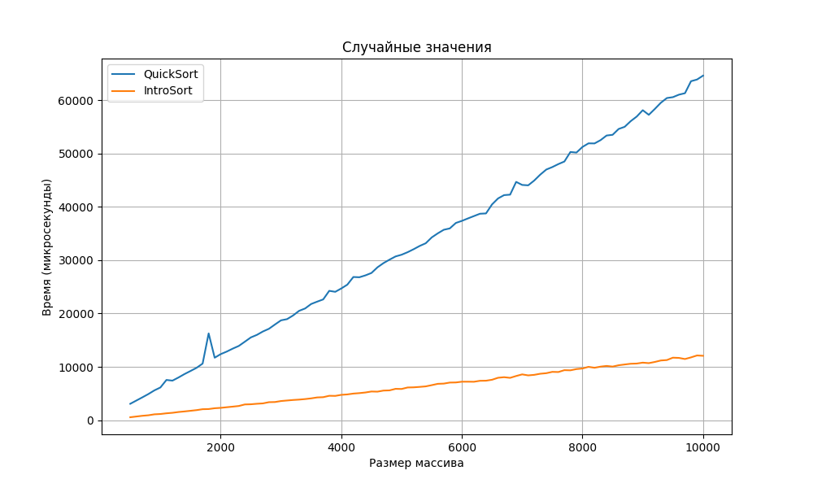
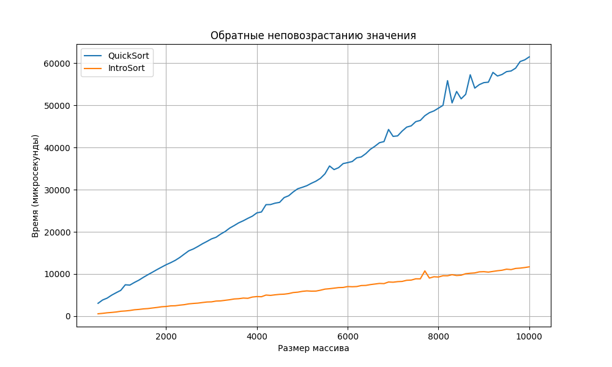
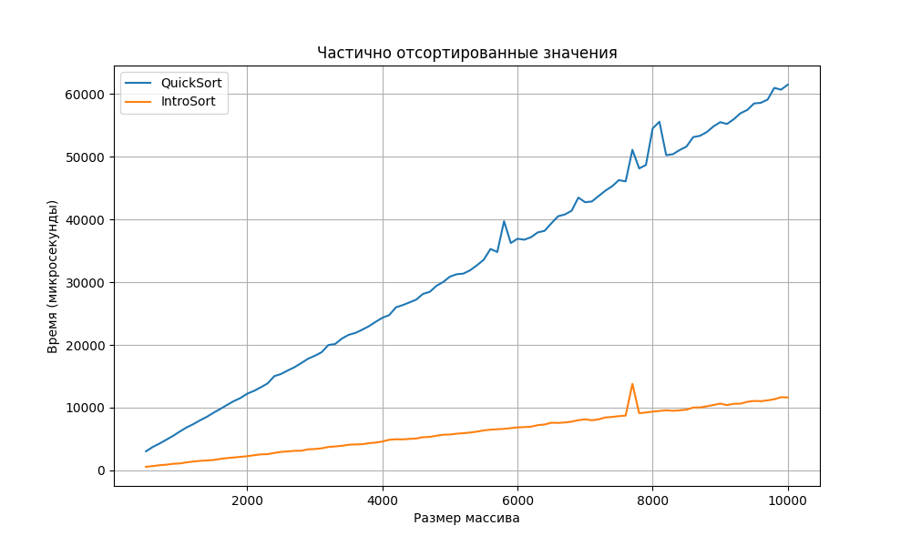

## Выводы по экспериментальному исследованию IntroSort

В ходе экспериментального исследования были сравнены временные характеристики стандартной рекурсивной реализации QuickSort со случайным выбором опорного элемента и гибридной реализации IntroSort, сочетающей QuickSort, HeapSort и InsertionSort.  Тестирование проводилось на трёх типах данных: случайных, обратно отсортированных и почти отсортированных массивах различного размера. Результаты замеров времени представлены в CSV файлах и визуализированы в виде графиков.

### Основные наблюдения:

* **Случайные данные:**  

* **Обратно отсортированные данные:** 

* **Почти отсортированные данные:** 

На всех типах данных мы видим, что IntroSort показывает более быстрее значения, даже в начале. Имеет большую стабильность и меньший отрыв по значениям на случайных данных в сравнении со своими показателями на обратно отсортированных и почти отсортированных данных.

**Сравнительный анализ:**

IntroSort, благодаря своим гибридным свойствам, демонстрирует более стабильную и предсказуемую производительность по сравнению со стандартным QuickSort. Это делает IntroSort предпочтительным выбором в большинстве практических случаев, где характер входных данных неизвестен заранее.

### Выводы:

* IntroSort обеспечивает гарантированную временную сложность O(n log n) в худшем случае, что является значительным преимуществом перед стандартным QuickSort.
* Использование InsertionSort для малых подмассивов и HeapSort для предотвращения деградации производительности делает IntroSort более эффективным и устойчивым алгоритмом сортировки.

### Другое
- ID посылки на codeforces: [292900889](https://dsahse.contest.codeforces.com/group/NOflOR1Qt0/contest/565612/submission/292900889)
- [Ссылка на реп](https://github.com/Gruz2520/introsort)

